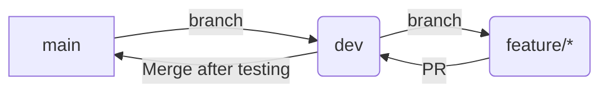

# 🏢 ExecuAI

> **An Agentic AI System for Autonomous Workflow Automation**

[](https://python.org)
[](https://fastapi.tiangolo.com)
[](https://reactjs.org/)
[](https://vitejs.dev/)
[](https://scikit-learn.org/)

ExecuAI is an intelligent enterprise assistant that doesn't just answer questions—it acts. By leveraging Agentic AI, it understands user intents, plans out execution steps, and autonomously interacts with enterprise systems to automate workflows.

### ✨ Key Capabilities
- **10 Autonomous Workflows**: End-to-end automation for Employee Onboarding, IT Provisioning, Access Management, Leave Requests, Meeting Scheduling, IT Tickets, Password Resets, Attrition Prediction, Reminders, and System Health.
- **Enterprise Integrations**: Native integration with Gmail (SMTP), Slack (Webhooks), Google Calendar (OAuth/Service Accounts), and GitHub (REST API), featuring graceful simulation fallbacks.
- **NVIDIA NIM Powered**: Natural language response polishing enhanced by `meta/llama-3.1-70b-instruct` via NVIDIA NIM.
- **Robust Reliability**: Backed by a comprehensive 79-test automated suite validating intents, entities, workflows, and integrations.

---

## 📁 Project Structure

The codebase is organized into distinct modules, making it easy for different teams to collaborate:

```text
ExecuAI/
├── backend/                       # FastAPI backend
│   ├── main.py                    # App entry-point (integrates all routers)
│   ├── config.py                  # Environment & app settings
│   ├── database.py                # SQLAlchemy engine & session
│   ├── models.py                  # ORM models (shared)
│   ├── schemas.py                 # Pydantic schemas (shared)
│   │
│   ├── employee/                  # 👨‍💻 Employee module (/api/employee/*)
│   ├── hr/                        # 👩‍💼 HR module (/api/hr/*)
│   └── it_admin/                  # 🛠️ IT Admin module (/api/it/*)
│
├── agent/                         # 🤖 AI Agent logic (AgentController & Tools)
├── ml/                            # 📊 Machine Learning (Attrition Prediction)
├── data/                          # Datasets & SQLite database
├── frontend/                      # 🎨 React + Vite frontend
├── .env.example                   # Environment variable template
├── .gitignore                     # Git ignore rules
└── requirements.txt               # Python dependencies
```

---

## 🚀 Quick Start

### 1. Clone & Set Up Virtual Environment

```bash
git clone https://github.com/Sujay-Kathi/ExecuAI.git
cd ExecuAI

# Activate existing virtual environment (Windows):
.venv\Scripts\activate
```

### 2. Install Dependencies

```bash
pip install -r requirements.txt
```

### 3. Configure Environment Variables

```bash
cp .env.example .env
# Open .env and add your OPENAI_API_KEY
```

### 4. Run the Platform

*(Note: For first-time setup, ensure you run `npm install` inside the `frontend` directory).*

Launch both the backend and frontend simultaneously using the provided startup script:

```powershell
.\run_all.ps1
```

- **API Base URL**: http://127.0.0.1:8000
- **Swagger Docs**: http://127.0.0.1:8000/docs
- **UI URL**: http://localhost:5173

### 5. Run the Test Suite

```bash
# Run the 79 end-to-end automation tests
python tests/test_automations.py
```

---

## 👥 Team Roles & Assignments

We have divided the backend and AI components into logical boundaries for feature development:

### 🤖 AI Engineer (`agent/`)
- **Focus:** LLM logic (`agent.py`) and tool integrations (`tools.py`).
- **Branch:** `feature/agent-logic`

### 🔧 Backend Developer (`backend/`)
- **Focus:** Core DB models, schemas, and API integration.
- **Branch:** `feature/backend-api`

### 👨‍💻 Feature Dev — Employee Module (`backend/employee/`)
- **Focus:** Leave applications, meeting scheduling, profile viewing.
- **Branch:** `feature/employee-module`

### 👩‍💼 Feature Dev — HR Module (`backend/hr/`)
- **Focus:** Employee onboarding, leave approvals, workforce insights.
- **Branch:** `feature/hr-module`

### 🛠️ Feature Dev — IT Admin Module (`backend/it_admin/`)
- **Focus:** System access management, system requests, health monitoring.
- **Branch:** `feature/it-module`

### 🎨 Frontend Developer (`frontend/`)
- **Focus:** Chat Panel, Execution Log Panel, and Dashboard UI.
- **Branch:** `feature/frontend-ui`

### 📊 ML Engineer (`ml/`)
- **Focus:** Attrition prediction model using the IBM HR Analytics dataset.
- **Branch:** `feature/ml-model`

### 🔗 Integration Lead
- **Focus:** Merging branches to `dev` and deploying to `main`.

---

## 🌿 Git Workflow

We follow a structured branching strategy:



**Rules:**
1. **Never** push directly to `main`.
2. Always create your feature branch from `main`.
3. Open a Pull Request (PR) to `dev` when your feature is ready.
4. The Integration Lead merges `dev` → `main` after successful end-to-end testing.

---

## 📡 Full API Reference

### 🌐 Shared Endpoints
| Method | Endpoint | Description |
|--------|----------|-------------|
| `GET` | `/` | Health check |
| `POST` | `/api/chat/` | Send message to AI agent |
| `POST` | `/api/ml/predict-attrition` | Predict employee attrition |

### 👨‍💻 Employee (`/api/employee/*`)
| Method | Endpoint | Description |
|--------|----------|-------------|
| `GET` | `/profile/{id}` | View profile |
| `POST` | `/leave` | Apply for leave |
| `GET` | `/leave/{id}` | View leave history |
| `POST` | `/meeting` | Schedule meeting |
| `GET` | `/meetings/{id}` | View scheduled meetings |
| `GET` | `/info/{id}` | Get salary, role & policies |

### 👩‍💼 HR (`/api/hr/*`)
| Method | Endpoint | Description |
|--------|----------|-------------|
| `POST` | `/onboard` | Onboard new employee |
| `GET` | `/employees` | List all employees |
| `GET` | `/leaves` | List all leave requests |
| `PATCH` | `/leaves/{id}` | Approve/reject leave |
| `GET` | `/insights` | Workforce analytics |

### 🛠️ IT Admin (`/api/it/*`)
| Method | Endpoint | Description |
|--------|----------|-------------|
| `POST` | `/access` | Request system access |
| `GET` | `/access` | List access requests |
| `PATCH` | `/access/{id}` | Grant/deny access |
| `POST` | `/system-request`| Submit IT request |
| `GET` | `/health` | System health |

---

## ⚙️ Tech Stack

| Component | Technology |
|-----------|------------|
| **LLM Engine** | NVIDIA NIM (`meta/llama-3.1-70b-instruct`) & OpenAI API |
| **Backend** | Python, FastAPI, SQLAlchemy |
| **Frontend** | React, Vite |
| **Database** | SQLite (for development) |
| **Integrations**| Gmail SMTP, Slack Webhooks, Google Calendar, GitHub API |
| **Machine Learning**| Scikit-learn (Random Forest) |
| **Version Control** | Git & GitHub |

---
*Built to transform traditional chatbots into intelligent enterprise agents.*